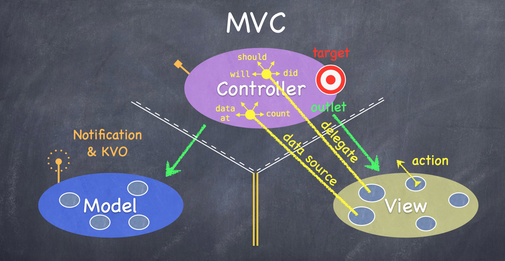

#1. Optional

You use optionals in sitations where a value may be absent. An optional says：There is a value，it equals x or There isn't a value:

    var surveyAnswer: String?
    // surveyAnswer is automatically set to nil

If you define an optional constant or variable without providing a default value, the constant or variable is automatically set to nil for you.

###1.1 If Statements and Forced Unwrapping
You can use an `if` statement to find out whether an optional contains a value. If an optional does have a value, it evaluates to true; if it has no value at all, it evaluates to false.

Once you’re sure that the optional does contain a value, you can access its underlying value by adding an exclamation mark `!` to the end of the optional’s name. The exclamation mark effectively says, “I know that this optional definitely has a value; please use it.” This is known as forced unwrapping of the optional’s value:

    if convertedNumber {
        println("\(possibleNumber) has an integer value of \(convertedNumber!)")
    }else{
        println("\(possibleNumber) could not be converted to an integer")
    }

Note:

Trying to use `!` to access a non-existent optional value triggers a runtime error. Always make sure that an optional contains a non-nil value before using ! to force-unwrap its value.

###1.2 Optional Binding

You use optional binding to find out whether an optional contains a value, and if so, to make that value available as a temporary constant or variable. Optional binding can be used with if and while statements to check for a value inside an optional, and to extract that value into a constant or variable, as part of a single action. 

Write optional bindings for the if statement as follows:
 
    if let constantName = someOptional { 
        statements
    }

###1.3 Implicitly Unwrapped Optionals

You can think of an implicitly unwrapped optional as giving permission for the optional to be unwrapped automatically whenever it is used. Rather than placing an exclamation mark after the optional’s name each time you use it, you place an exclamation mark after the optional’s type when you declare it.

    let possibleString: String? = "An optional string."
	println(possibleString!) 
    // requires an exclamation mark to access its value
	
	let assumedString: String! = "An implicitly unwrapped optional string."
	println(assumedString) 

	// no exclamation mark is needed to access its value

Note:

Implicitly unwrapped optionals should not be used when there is a possibility of a variable becoming nil at a later point. Always use a normal optional type if you need to check for a nil value during the lifetime of a variable.

# 2.computed property
computed properties do not actually store a value. Instead, they provide a getter and an optional setter to retrieve and set other properties and values indirectly.

### Shorthand Setter Declaration

If a computed property’s setter does not define a name for the new value to be set, a default name of newValue is used.

### Read-Only Computed Properties
A computed property with a getter but no setter is known as a read-only computed property. A read-only computed property always returns a value, and can be accessed through dot syntax, but cannot be set to a different value.

You can simplify the declaration of a read-only computed property by removing the get keyword and its braces.

# 3. Closure

# 4. MVC
#####1. MVC is basically a mechanism wherewe divide objects in your program into 3 “camps.”

- Model = What your application is (but not how it is displayed)

- Controller = How your Model is presented to the user (UI logic)

- View = Your Controller’s  minions.

#####2. It’s all about managing communication between camps.Controllers interpret/format Model information for the View.

1. Controllers can always talk directly to their Model and View.
but the Model and View should never speak to each other.

2. View speak to its Controller is “blind” and structured.

    - The Controller can drop a target on itself.Then hand out an action to the View.The View sends the action when things happen in the UI.Sometimes the View needs to synchronize with the Controller.

    - The Controller sets itself as the View’s delegate.The delegate is set via a protocol (i.e. it’s “blind” to class).

    - Views do not own the data they display.So, if needed, they have a protocol to acquire it.Controllers are almost always that data source (not Model!).

3. The Model is (should be) UI independent.if the Model has information to update or something?It uses a “radio station”-like broadcast mechanism.
Controllers (or other Model) “tune in” to interesting stuff.A View might “tune in,” but probably not to a Model’s “station.”

